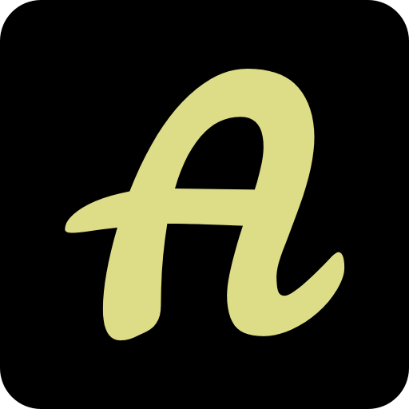
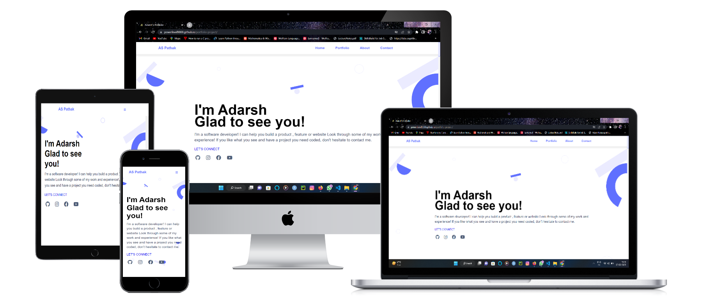

<a name="readme-top"></a>

<!--
HOW TO USE:
This is an example of how you may give instructions on setting up your project locally.

Modify this file to match your project and remove sections that don't apply.

REQUIRED SECTIONS:
- Table of Contents
- About the Project
  - Built With
  - Live Demo
- Getting Started
- Authors
- Future Features
- Contributing
- Show your support
- Acknowledgements
- License

After you're finished please remove all the comments and instructions!
-->

<div align="center">
  <!-- You are encouraged to replace this logo with your own! Otherwise you can also remove it. -->
  
  <br/>

  <h3><b>Adarsh's Portfolio</b></h3>
  <br><br>
  <br><br>
  <br><br>
  <h1>App Mock</h1>
  <br><br>
  <br><br>
  
</div>

<!-- TABLE OF CONTENTS -->

# 📗 Table of Contents

- [📖 About the Project](#about-project)
  - [🛠 Built With](#built-with)
    - [Tech Stack](#tech-stack)
    - [Key Features](#key-features)
  - [🚀 Live Demo](#live-demo)
- [💻 Getting Started](#getting-started)
  - [Setup](#setup)
  - [Prerequisites](#prerequisites)
  - [Install](#install)
  - [Usage](#usage)
  - [Run tests](#run-tests)
  - [Deployment](#triangular_flag_on_post-deployment)
- [👥 Authors](#authors)
- [🔭 Future Features](#future-features)
- [🤝 Contributing](#contributing)
- [⭐️ Show your support](#support)
- [🙏 Acknowledgements](#acknowledgements)
- [❓ FAQ](#faq)
- [📝 License](#license)

<!-- PROJECT DESCRIPTION -->

# 📖 Adarsh's Portfolio <a name="about-project"></a>

> This project is all about me but still there are many things you should know about me and those are not mentioned here. wana talk face to face ?

**Adarsh's Portfolio** is just a small introduction and limited skills mentioned there due to project design

## 🛠 Built With <a name="built-with"></a>

### Tech Stack <a name="tech-stack"></a>

> In this project me and my collaborators used many skills, tech and libraries

<details>
  <summary>Documentation</summary>
  <ul>
    <li><a href="https://html.com">HTML</a></li>
  </ul>
</details>

<details>
  <summary>Styling</summary>
  <ul>
    <li><a href="https://www.w3.org">CSS</a></li>
  </ul>
</details>

<details>
<summary>Annimation</summary>
  <ul>
    <li><a href="https://michalsnik.github.io/aos/">Aos.js</a></li>
  </ul>
</details>

<!-- Features -->

### Key Features <a name="key-features"></a>

> Following features you should observe

- **Animation on scroll**
- **button hovers**
- **navigation bar fixed on scroll**
- **navigation menu is clickable**

<p align="right">(<a href="#readme-top">back to top</a>)</p>

<!-- LIVE DEMO -->

## 🚀 Live Demo <a name="live-demo"></a>

> This link will guide you to my project

- [Live Demo Link](https://powerlevel9000.github.io/portfolio-project/)

<p align="right">(<a href="#readme-top">back to top</a>)</p>

<!-- GETTING STARTED -->

## 💻 Getting Started <a name="getting-started"></a>

>For having local file and project you can fork this repo 

>And for making changes you you should follow prerequisites


### Prerequisites

In order to edit this project you need:

 - Any text editor such as note pad and word pad
 - A web browser

#### suggested 
 - visual studio code
 - atom 
 - visual code 
<!--
Example command:

```sh
 gem install rails
```
 -->

### Setup

Clone this repository to your desired folder:

 - click on index.html
 - open in the browser


### Usage

 Execute the following thing:
 
 - See project buttons
 - Navigation bar on desktop version
<!--
Example command:

```sh
  rails server
```
--->

### Run tests

- Check whether animation is good or too much animation
- check all the link on social icons are working or not 
- also click on let's connect to mail me 
- also i want to add call me button give suggestion 

<!--
Example command:

```sh
  bin/rails test test/models/article_test.rb
```
--->

### Deployment

You can deploy this project using:

- for this repo and use git hub pages to deploy it 

<!--
Example:

```sh

```
 -->

<p align="right">(<a href="#readme-top">back to top</a>)</p>

<!-- AUTHORS -->

## 👥 Authors <a name="authors"></a>

> Every small collaboration made by various authors  mentioned here 

👤 **Adarsh Pathak**

- GitHub: [@PowerLevel9000](https://github.com/githubhandle)
- Twitter: [@PowerLevel9002](https://twitter.com/PowerLevel9002?t=AIuSN7mTxk5a_MWpLolEjA&s=09)
- LinkedIn: [@Adarsh Pathak](https://www.linkedin.com/in/adarsh-pathak-56a831256/)

👤 **Rubén D. Pire**

- GitHub: [@rpire](https://github.com/rpire)

👤 **Author2**

- GitHub: [@zewdu444](https://github.com/zewdu444)

👤 **kingnoel**

- GitHub: [@kingnoel](https://github.com/kingnoel)

👤 **Amazinggracee**

- GitHub: [@amazinggacee](https://github.com/Amazinggracee)
- Twitter: [@amazinggaceu](https://twitter.com/amazinggraceu)
- LinkedIn: [Amarachi Dimkpa](https://linkedin.com/in/amarachi-dimkpa-070643183)

👤 **Leslie Aine**

- GitHub: [@LeslieAine](https://github.com/LeslieAine)

<p align="right">(<a href="#readme-top">back to top</a>)</p>

<!-- FUTURE FEATURES -->

## 🔭 Future Features <a name="future-features"></a>

> Describe 1 - 3 features you will add to the project.

- [ ] **popup menu**
- [ ] **more advance projects will be added there**
- [ ] **work on styling and lenguages**

<p align="right">(<a href="#readme-top">back to top</a>)</p>

<!-- CONTRIBUTING -->

## 🤝 Contributing <a name="contributing"></a>

Contributions, issues, and feature requests are welcome!

Feel free to check the [issues page](../../issues/).

<p align="right">(<a href="#readme-top">back to top</a>)</p>

<!-- SUPPORT -->

<!--## ⭐️ Show your support <a name="support"></a>

> 

If you like this project...-->

<p align="right">(<a href="#readme-top">back to top</a>)</p>

<!-- ACKNOWLEDGEMENTS -->

## 🙏 Acknowledgments <a name="acknowledgements"></a>

> Give credit to everyone who inspired your codebase.

I would like to thank ruben for helping me 

<p align="right">(<a href="#readme-top">back to top</a>)</p>

<!-- FAQ (optional) -->

## ❓ FAQ <a name="faq"></a>

> ask questions to be here 

- **[Question_1]**

  - [Answer_1]

- **[Question_2]**

  - [Answer_2]

<p align="right">(<a href="#readme-top">back to top</a>)</p>

<!-- LICENSE -->

## 📝 License <a name="license"></a>

This project is [MIT](./LICENSE) licensed.

_NOTE: we recommend using the [MIT license](https://choosealicense.com/licenses/mit/) - you can set it up quickly by [using templates available on GitHub](https://docs.github.com/en/communities/setting-up-your-project-for-healthy-contributions/adding-a-license-to-a-repository). You can also use [any other license](https://choosealicense.com/licenses/) if you wish._

<p align="right">(<a href="#readme-top">back to top</a>)</p>
